# Library Management System

A full-stack Library Management System built with React, TypeScript, Node.js, and MongoDB.

## Project Overview

This project implements a modern Library Management System with features for managing books, users, and borrowing operations. The system is built using a microservices architecture with separate frontend and backend services.

## Work Breakdown Structure (WBS)

```mermaid
graph TD
    A[Library Management System<br/>100%] --> B[Project Setup<br/>10%]
    A --> C[Backend Development<br/>35%]
    A --> D[Frontend Development<br/>40%]
    A --> E[Testing & QA<br/>10%]
    A --> F[Deployment & DevOps<br/>5%]

    %% Project Setup Breakdown
    B --> B1[Project Initialization<br/>4%]
    B --> B2[Git Setup<br/>3%]
    B --> B3[CI/CD Pipeline<br/>3%]

    %% Backend Development Breakdown
    C --> C1[Core Infrastructure<br/>10%]
    C --> C2[Authentication System<br/>10%]
    C --> C3[API Development<br/>15%]

    C1 --> C1a[Express.js Setup]
    C1 --> C1b[MongoDB Config]
    C1 --> C1c[Security Middleware]

    C2 --> C2a[User Model]
    C2 --> C2b[JWT Auth]
    C2 --> C2c[Password Management]

    C3 --> C3a[Book Management]
    C3 --> C3b[User Management]
    C3 --> C3c[Borrowing System]

    %% Frontend Development Breakdown
    D --> D1[Core Setup<br/>10%]
    D --> D2[Component Development<br/>15%]
    D --> D3[State Management<br/>10%]
    D --> D4[UI/UX Implementation<br/>5%]

    D1 --> D1a[React + TypeScript]
    D1 --> D1b[Vite Config]
    D1 --> D1c[Tailwind CSS]

    D2 --> D2a[Auth Components]
    D2 --> D2b[Book Components]
    D2 --> D2c[User Components]
    D2 --> D2d[Borrowing Components]

    D3 --> D3a[API Client]
    D3 --> D3b[State Implementation]
    D3 --> D3c[Error Handling]

    D4 --> D4a[Responsive Design]
    D4 --> D4b[Theme System]
    D4 --> D4c[Animations]

    %% Testing & QA Breakdown
    E --> E1[Unit Testing<br/>3%]
    E --> E2[Integration Testing<br/>3%]
    E --> E3[E2E Testing<br/>2%]
    E --> E4[Performance Testing<br/>1%]
    E --> E5[Security Testing<br/>1%]

    %% Deployment & DevOps Breakdown
    F --> F1[Production Build<br/>2%]
    F --> F2[Deployment Config<br/>1%]
    F --> F3[Monitoring<br/>1%]
    F --> F4[Backup Strategy<br/>1%]

    %% Styling
    classDef main fill:#f9f,stroke:#333,stroke-width:2px
    classDef phase fill:#bbf,stroke:#333,stroke-width:1px
    classDef task fill:#dfd,stroke:#333,stroke-width:1px

    class A main
    class B,C,D,E,F phase
    class B1,B2,B3,C1,C2,C3,D1,D2,D3,D4,E1,E2,E3,E4,E5,F1,F2,F3,F4 task
```



### Status Legend
- ✅ Completed
- 🔄 In Progress
- ⏳ Pending

### Detailed Component Breakdown

#### 1. Project Setup and Infrastructure (10%)
| Component | Percentage | Status |
|-----------|------------|--------|
| Project Initialization | 4% | ✅ |
| Git Setup | 3% | ✅ |
| CI/CD Pipeline | 3% | ✅ |

#### 2. Backend Development (35%)
| Component | Sub-Component | Description | Status |
|-----------|---------------|-------------|--------|
| Core Infrastructure (10%) | Express.js Setup | Server configuration and middleware setup | ✅ |
| | MongoDB Configuration | Database connection and schema setup | ✅ |
| | Security Middleware | Implementation of security features (Helmet, CORS, etc.) | ✅ |
| Authentication System (10%) | User Model | User schema and validation | ✅ |
| | JWT Implementation | Token-based authentication system | ✅ |
| | Password Management | Hashing and verification system | ✅ |
| | Email Verification | User email verification system | ✅ |
| API Development (15%) | Book Management | CRUD operations for books | ✅ |
| | User Management | User profile and settings management | ✅ |
| | Borrowing System | Book borrowing and return logic | ✅ |
| | Search/Filter | Advanced search and filtering capabilities | ✅ |
| | Error Handling | Global error handling middleware | ✅ |

#### 3. Frontend Development (40%)
| Component | Sub-Component | Description | Status |
|-----------|---------------|-------------|--------|
| Core Setup (10%) | React + TypeScript | Project foundation and type system | ✅ |
| | Vite Configuration | Build tool and development setup | ✅ |
| | Tailwind CSS | Styling system implementation | ✅ |
| | ESLint/Prettier | Code quality and formatting | ✅ |
| Component Development (15%) | Authentication | Login, Registration, Password Reset | ✅ |
| | Book Management | Listing, Details, Search interface | ✅ |
| | User Management | Profile and settings interface | ✅ |
| | Borrowing System | Borrow and return interface | ✅ |
| State Management (10%) | API Client | Axios setup and interceptors | ✅ |
| | State Implementation | Global state management | ✅ |
| | Error Handling | Frontend error management | ✅ |
| | Loading States | Loading indicators and states | ✅ |
| UI/UX Implementation (5%) | Responsive Design | Mobile-first responsive layout | ✅ |
| | Theme System | Dark/Light mode implementation | ✅ |
| | Animations | Loading and transition animations | ✅ |
| | Error States | Error message displays | ✅ |
| | Success Feedback | Success notifications and feedback | ✅ |

#### 4. Testing and Quality Assurance (10%)
| Component | Percentage | Status |
|-----------|------------|--------|
| Unit Testing | 3% | ✅ |
| Integration Testing | 3% | ✅ |
| E2E Testing | 2% | ✅ |
| Performance Testing | 1% | ✅ |
| Security Testing | 1% | ✅ |

#### 5. Deployment and DevOps (5%)
| Component | Percentage | Status |
|-----------|------------|--------|
| Production Build | 2% | ✅ |
| Deployment Config | 1% | ✅ |
| Monitoring | 1% | ✅ |
| Backup Strategy | 1% | ✅ |

### Component Details

#### Backend Components
```
┌─────────────────────────────────────────────────────────┐
│ Backend Development (35%)                                │
├─────────────────┬─────────────────┬─────────────────────┤
│ Core Infra      │ Auth System     │ API Development     │
│ (10%)           │ (10%)           │ (15%)               │
├─────────────────┼─────────────────┼─────────────────────┤
│ • Express.js    │ • User Model    │ • Book Management   │
│ • MongoDB       │ • JWT Auth      │ • User Management   │
│ • Security      │ • Password Hash │ • Borrowing System  │
│ • Environment   │ • Email Verify  │ • Search/Filter     │
└─────────────────┴─────────────────┴─────────────────────┘
```

#### Frontend Components
```
┌─────────────────────────────────────────────────────────┐
│ Frontend Development (40%)                              │
├─────────────────┬─────────────────┬─────────────────────┤
│ Core Setup      │ Components      │ State Management    │
│ (10%)           │ (15%)           │ (10%)               │
├─────────────────┼─────────────────┼─────────────────────┤
│ • React+TS      │ • Auth          │ • API Client        │
│ • Vite          │ • Book Mgmt     │ • State Management  │
│ • Tailwind      │ • User Mgmt     │ • Error Handling    │
│ • ESLint        │ • Borrowing     │ • Loading States    │
└─────────────────┴─────────────────┴─────────────────────┘
```

## Technology Stack

### Frontend
- React 18
- TypeScript
- Vite
- Tailwind CSS
- React Router DOM
- Axios
- React Icons
- React Toastify

### Backend
- Node.js
- Express.js
- MongoDB with Mongoose
- JWT Authentication
- Nodemailer
- Express Validator
- Bcrypt.js

## Getting Started

### Prerequisites
- Node.js (v14 or higher)
- MongoDB
- npm or yarn

### Installation

1. Clone the repository:
```bash
git clone [repository-url]
```

2. Install backend dependencies:
```bash
cd Backend
npm install
```

3. Install frontend dependencies:
```bash
cd Frontend
npm install
```

4. Set up environment variables:
- Create `.env` file in Backend directory
- Create `.env` file in Frontend directory

5. Start the development servers:

Backend:
```bash
cd Backend
npm run dev
```

Frontend:
```bash
cd Frontend
npm run dev
```

## Contributing

1. Fork the repository
2. Create your feature branch (`git checkout -b feature/AmazingFeature`)
3. Commit your changes (`git commit -m 'Add some AmazingFeature'`)
4. Push to the branch (`git push origin feature/AmazingFeature`)
5. Open a Pull Request

## License

This project is licensed under the ISC License.

## Contact

[Your Name] - [Your Email]

Project Link: [https://github.com/yourusername/library-management-system] 