# Library Management System

## Project Overview
This is a full-stack Library Management System built with React/TypeScript frontend and Node.js/Express backend. The system provides comprehensive library management features including book management, user management, authentication, and more.

## Technology Stack
- **Frontend**: React, TypeScript, TailwindCSS, Vite
- **Backend**: Node.js, Express, MongoDB
- **Authentication**: JWT
- **Security**: Helmet, Express Rate Limit, Express Mongo Sanitize

## Work Breakdown Structure (WBS)

```mermaid
graph TD
    A[Library Management System] --> B[Frontend Development]
    A --> C[Backend Development]
    A --> D[Project Management]
    A --> E[Testing & Quality Assurance]
    A --> F[Deployment & DevOps]

    %% Frontend Development
    B --> B1[UI/UX Design]
    B1 --> B1.1[Component Design]
    B1.1 --> B1.1.1[Layout Components]
    B1.1 --> B1.1.2[Form Components]
    B1.1 --> B1.1.3[Modal Components]
    B1 --> B1.2[Responsive Design]
    B1 --> B1.3[Theme Implementation]

    B --> B2[Feature Implementation]
    B2 --> B2.1[Authentication]
    B2 --> B2.2[Book Management]
    B2 --> B2.3[User Management]
    B2 --> B2.4[Search & Filter]
    B2 --> B2.5[Notifications]

    B --> B3[State Management]
    B3 --> B3.1[Context Setup]
    B3 --> B3.2[API Integration]
    B3 --> B3.3[Error Handling]

    %% Backend Development
    C --> C1[API Development]
    C1 --> C1.1[Authentication Routes]
    C1 --> C1.2[Book Routes]
    C1 --> C1.3[User Routes]
    C1 --> C1.4[Search Routes]

    C --> C2[Database Design]
    C2 --> C2.1[Schema Design]
    C2 --> C2.2[Indexing]
    C2 --> C2.3[Data Validation]

    C --> C3[Security Implementation]
    C3 --> C3.1[JWT Implementation]
    C3 --> C3.2[Rate Limiting]
    C3 --> C3.3[Input Sanitization]
    C3 --> C3.4[Error Handling]

    %% Project Management
    D --> D1[Requirements Analysis]
    D --> D2[Project Planning]
    D --> D3[Documentation]
    D --> D4[Version Control]

    %% Testing & Quality Assurance
    E --> E1[Frontend Testing]
    E1 --> E1.1[Unit Tests]
    E1 --> E1.2[Integration Tests]
    E1 --> E1.3[E2E Tests]

    E --> E2[Backend Testing]
    E2 --> E2.1[Unit Tests]
    E2 --> E2.2[Integration Tests]
    E2 --> E2.3[API Tests]

    E --> E3[Performance Testing]
    E --> E4[Security Testing]

    %% Deployment & DevOps
    F --> F1[Environment Setup]
    F --> F2[CI/CD Pipeline]
    F --> F3[Monitoring]
    F --> F4[Backup Strategy]
```



## Project Structure
```
├── Frontend/
│   ├── src/
│   ├── public/
│   ├── package.json
│   └── vite.config.ts
├── Backend/
│   ├── src/
│   ├── routes/
│   ├── models/
│   ├── controllers/
│   └── package.json
└── README.md
```

## Getting Started

### Prerequisites
- Node.js (v14 or higher)
- MongoDB
- npm or yarn

### Frontend Setup
1. Navigate to the Frontend directory:
   ```bash
   cd Frontend
   ```
2. Install dependencies:
   ```bash
   npm install
   ```
3. Start development server:
   ```bash
   npm run dev
   ```

### Backend Setup
1. Navigate to the Backend directory:
   ```bash
   cd Backend
   ```
2. Install dependencies:
   ```bash
   npm install
   ```
3. Create a `.env` file with required environment variables
4. Start the server:
   ```bash
   npm run dev
   ```

## Features
- User Authentication and Authorization
- Book Management (Add, Edit, Delete, Search)
- User Management
- Responsive Design
- Real-time Notifications
- Search and Filter Functionality

## Security Features
- JWT Authentication
- Rate Limiting
- Input Sanitization
- Secure Password Hashing
- CORS Protection
- Helmet Security Headers

## Testing
- Frontend Unit Tests
- Backend API Tests
- Integration Tests
- End-to-End Tests
- Performance Testing
- Security Testing

## Contributing
1. Fork the repository
2. Create your feature branch (`git checkout -b feature/AmazingFeature`)
3. Commit your changes (`git commit -m 'Add some AmazingFeature'`)
4. Push to the branch (`git push origin feature/AmazingFeature`)
5. Open a Pull Request

## License
This project is licensed under the ISC License.

## Contact
For any queries or support, please open an issue in the repository. 